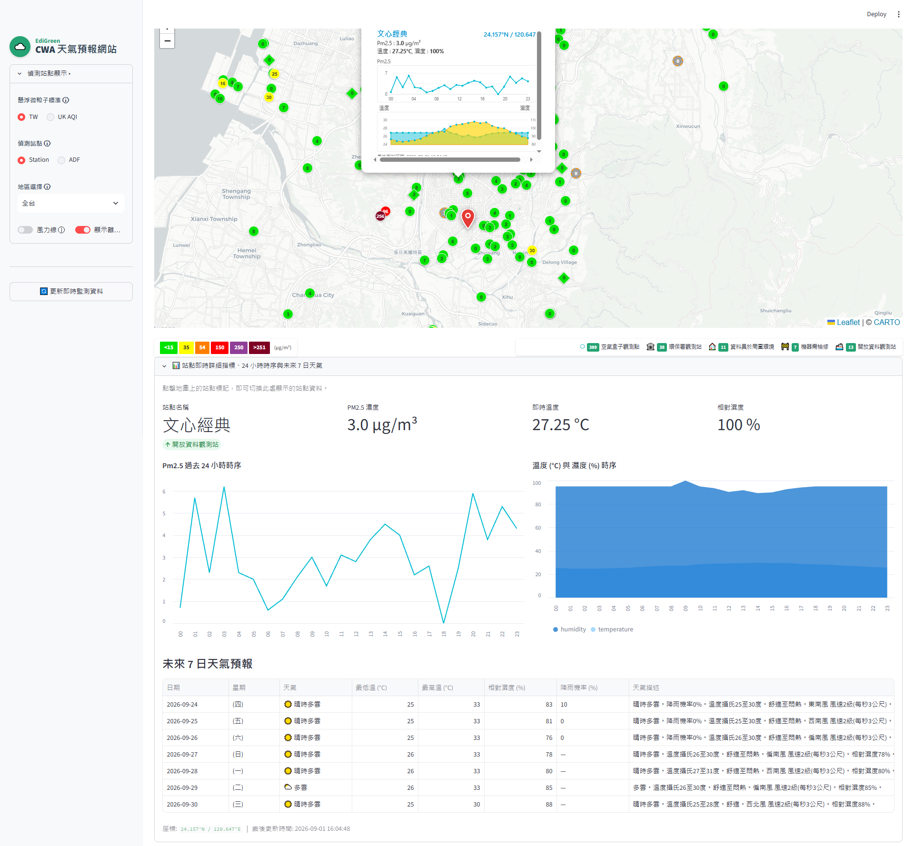

# Sheng Wang - 空氣品質檢測

以台灣空氣品質與氣象站點為主題的互動式儀表板。透過地圖瀏覽測站即時 PM2.5、溫度與濕度，點選站點可查看 24 小時趨勢及未來 7 日天氣預報。



## 網站功能特色

- **作者：Sheng Wang**
- **台灣測站互動地圖**：使用 Folium 呈現站點位置，點選地圖標記後，下方詳細資訊同步切換為該站資料。
- **空氣品質與氣象資訊**：顯示 PM2.5、溫度、濕度、站點類型及最後更新時間。
- **24 小時趨勢圖**：提供 PM2.5 折線圖，以及溫度、濕度趨勢圖。
- **未來 7 日預報**：顯示日期、天氣、高低溫、濕度、降雨機率及預報描述。
- **地區篩選**：可瀏覽全台、北部、中部、南部、東部、東北、東南與外島站點。
- **地圖顯示控制**：可切換風力線及離線站點，並透過圖例辨識 PM2.5 色階與站點類型。
- **資料庫快取**：站點資訊、歷史資料與七日預報儲存於 SQLite。瀏覽和切換站點時讀取資料庫；使用者按下更新，或首次載入時需要補齊資料，才會呼叫 API 同步並寫入資料庫。
- **載入提示**：首次準備資料與地圖時顯示載入遮罩。

## 檔案結構

```text
L2CWA/
├── app.py                         # Streamlit 頁面、地圖與互動流程
├── fetch_weather.py               # CWA、AirBox 與 EPA API 資料抓取
├── parse_weather.py               # API 回應解析、站點分類與預報整理
├── database.py                    # SQLite 資料表與讀寫函式
├── requirements.txt               # Python 套件清單
├── .env.example                   # API 設定範例（不含真實金鑰）
├── .gitignore                     # 排除密鑰、資料庫與 Python 暫存檔
├── README.md                      # 專案說明
├── image/
│   └── demo.png                   # 網站畫面示意圖
├── data/
│   └── data.db                    # 執行時建立的 SQLite 資料庫（不提交至 Git）
└── tests/
    ├── test_fetch.py              # API 抓取行為測試
    ├── test_parser.py             # 資料解析測試
    └── test_database.py           # 資料庫操作測試
```

其他檔案：`AGENT_PROMPT_Taiwan_Weather_HW10.md` 是專案規格提示文件；`db_test.py` 與 `scratch_api.py` 為輔助測試／探索程式。

## 技術問答與說明

### 網站使用哪些資料來源？

- **CWA（中央氣象署）Open Data**：七日天氣預報；需要在環境變數設定 `CWA_API_KEY`。
- **LASS AirBox 與 EPA 開放資料**：空氣品質站點資料。這些資料源目前由程式直接抓取，不需要在 README 或程式碼中放置 API 金鑰。
- **CARTO 底圖**：提供地圖底圖；需設定有效的 `CARTO_API_KEY`，否則圖磚會顯示 CARTO 的「API KEY REQUIRED」浮水印。

### 點選站點時會重新呼叫 API 嗎？

不會。地圖、站點詳細資料、24 小時歷史與七日預報都從 SQLite 查詢。API 呼叫只用於初次資料補齊或使用者按下「更新即時監測資料」時；抓到的資料會解析後寫入資料庫。

### 為什麼預報可能顯示空白？

請確認 `.env` 中的 `CWA_API_KEY` 有效，並確認能連線至 CWA Open Data。API 若暫時無法使用，畫面會提示沒有該站點的預報快取；成功同步後即可從資料庫讀取。

### 為什麼不能直接部署到 GitHub Pages？

GitHub Pages 只提供靜態網站託管，不能執行這個專案所需的 Python、Streamlit 伺服器、SQLite 寫入操作或後端 API 呼叫。因此，Pages **不能直接部署並執行本互動式儀表板**。若只要展示靜態介紹頁或截圖，可另外製作靜態前端；若要讓 Streamlit 網站可互動，請使用下方的 Streamlit Community Cloud 部署方式。

### API 金鑰如何保護？

將金鑰放在本機 `.env`，不要寫進 Python 程式或提交至 Git。部署到 Streamlit Community Cloud 時，將金鑰設定在 App 的 **Secrets**，不要公開 `.env`。

## 本機執行方式

以下以 Windows PowerShell 為例；macOS/Linux 的啟用指令列於步驟 2。

1. **複製專案並進入目錄**

   ```powershell
   git clone <repository-url>
   cd L2CWA
   ```

2. **建立及啟用虛擬環境**

   ```powershell
   python -m venv .venv
   .venv\Scripts\Activate.ps1
   ```

   macOS/Linux：

   ```bash
   python3 -m venv .venv
   source .venv/bin/activate
   ```

3. **安裝套件**

   ```bash
   python -m pip install -r requirements.txt
   ```

4. **設定環境變數**

   將 `.env.example` 複製為 `.env`，並填入有效的 CWA API Key：

   ```env
   CWA_API_KEY=你的中央氣象署API金鑰
   CWA_API_URL=https://opendata.cwa.gov.tw/api/v1/rest/datastore/F-C0032-001
   CARTO_API_KEY=你的CARTO金鑰
   ```

   `.env` 已列入 `.gitignore`，請勿提交含有真實金鑰的檔案。

5. **啟動網站**

   ```bash
   streamlit run app.py
   ```

   在瀏覽器開啟 Streamlit 顯示的網址，預設為 `http://localhost:8501`。首次啟動會初始化 SQLite 資料庫並在需要時同步資料；之後可透過側邊欄按鈕更新資料。

6. **執行測試（選用）**

   ```bash
   python -m pytest -q
   ```

## 部署到 GitHub Pages 步驟

> **部署限制：**GitHub Pages 無法執行本專案的 Streamlit/Python 後端。以下步驟只適用於發布靜態介紹頁，不會讓互動地圖、資料庫或 API 更新功能在線上運作。

### 若要發布靜態介紹頁

1. 將專案推送到 GitHub repository，並確認沒有提交 `.env`、真實 API Key 或 `data/data.db`。
2. 在 repository 新增靜態網站首頁，例如 `docs/index.html`（或 `docs/index.md`），放入專案介紹、`image/demo.png` 截圖及連往實際應用的連結。
3. 確認圖片相對路徑正確；使用 `docs/` 作為發布來源時，請將圖片放在 `docs/image/demo.png`，或調整首頁圖片連結。
4. 前往 GitHub repository 的 **Settings → Pages**。
5. 在 **Build and deployment** 中選擇 **Deploy from a branch**。
6. 選擇 `main` 分支及 `/docs` 資料夾，按下 **Save**。
7. 等待 GitHub Pages 部署完成，再從 Pages 設定頁提供的網址檢視靜態網站。

### 若要部署可互動的 Streamlit 儀表板（建議）

1. 將專案推送到 GitHub repository，確認 `.env` 和 SQLite 資料庫沒有被提交。
2. 登入 [Streamlit Community Cloud](https://share.streamlit.io/) 並連結 GitHub 帳號。
3. 建立新 App，選擇 repository、分支及 `app.py` 作為主程式。
4. 在 Streamlit Community Cloud 的 App **Settings → Secrets** 設定 API 金鑰。Secrets 範例如下：

   ```toml
   CWA_API_KEY = "你的中央氣象署API金鑰"
   CWA_API_URL = "https://opendata.cwa.gov.tw/api/v1/rest/datastore/F-C0032-001"
   CARTO_API_KEY = "你的CARTO金鑰"
   ```

   地圖底圖會從 `st.secrets` 讀取 `CARTO_API_KEY`（本機則可放在 `.env`）。若未設定或金鑰無效，CARTO 會在地圖圖磚上顯示 API key 錯誤浮水印。

5. 部署並開啟主機提供的網址。Streamlit Cloud 的本機檔案系統可能在重新部署或休眠後重置；若需要長期持久保存 SQLite 資料，請改用外部資料庫或持久化儲存服務。
